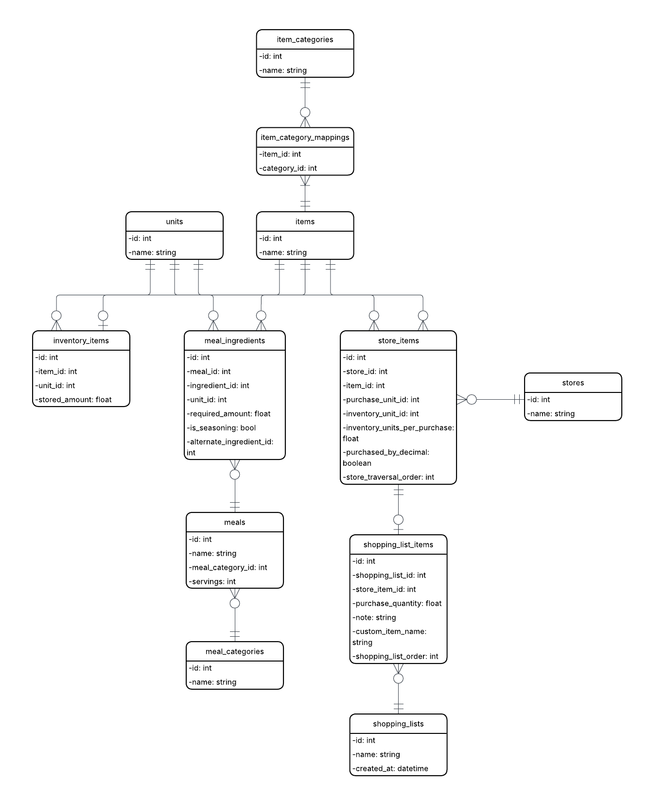

# Forage

## Overview

Forage is a grocery list generation app designed to streamline meal planning and grocery shopping. The application maintains an inventory of available items and stores recipes for defined meals. Given a set of planned meals, Forage computes the required ingredients and produces a consolidated grocery list that accounts for existing inventory. The generated list can be supplemented with additional items, including non-food items (e.g., household supplies and toiletries).

## Installation & Setup

### Prerequisites

- Go 1.25.5 or later
- PostgreSQL 12 or later
- Git

### Local Development

1. **Clone the repository**
   ```sh
   git clone https://github.com/rjmcnamara10/forage.git
   cd forage
   ```

2. **Set up the database**
   
   Using the command line:
   ```sh
   # Create the database
   createdb -U postgres forage
   
   # Execute the schema
   psql -U postgres -d forage -f backend/db/schema.sql
   ```

   Using pgAdmin GUI:
   - Create a new database named `forage`
   - Open a query editor and copy/paste the contents of `backend/db/schema.sql`
   - Execute the query

3. **Configure environment variables**
   ```sh
   cd backend
   cp .env.example .env
   ```
   
   Edit `.env` with your PostgreSQL credentials:
   ```
   DB_HOST=localhost
   DB_PORT=5432
   DB_USER=postgres
   DB_PASSWORD=your_postgres_superuser_password
   DB_NAME=forage
   ```

4. **Install Go dependencies**
   ```sh
   cd backend
   go mod download
   ```

5. **Run the server**
   ```sh
   go run main.go
   ```

## Project Structure

```
forage/
├── backend/          # Go backend server
│   ├── db/           # Database connection and schema
│   ├── models/       # Data models
│   ├── handlers/     # API route handlers
│   └── main.go       # Entry point
└── frontend/         # Frontend application (TBD)
```

## API Documentation

_To be added_

### Database Schema



The database schema is defined in `backend/db/schema.sql` and includes tables for:
- Items, units, and categories
- Inventory tracking
- Meals and ingredients
- Stores and store items
- Shopping lists

#### Item Quantity Representation Patterns
Items are represented differently based on their quantity/unit combination:
- Measured: has quantity + unit ("6 slices of bread", "1.25 lbs of deli turkey")
- Counted: has quantity, no unit ("3 chicken breasts", "4 bananas")  
- Presence-based: no quantity or unit ("BBQ sauce", "Garlic powder")
